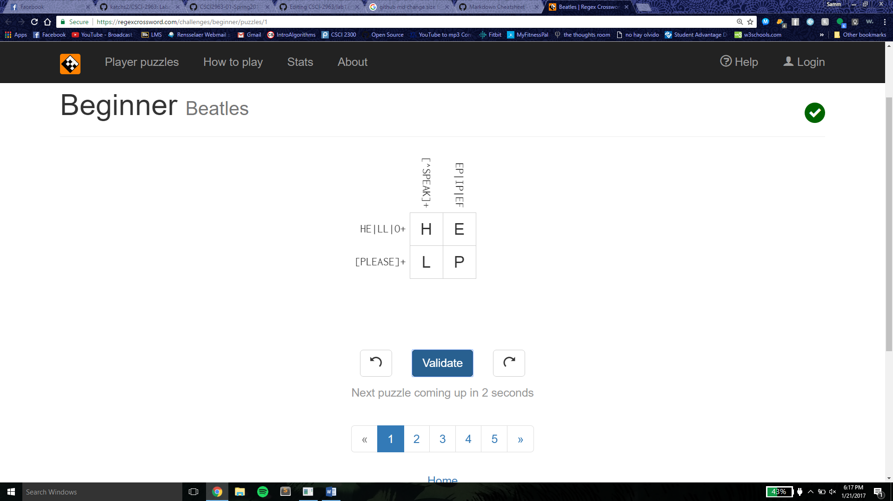
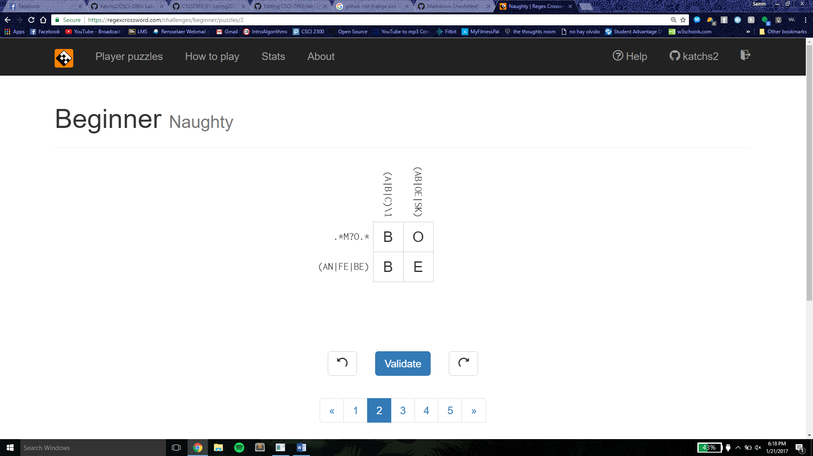
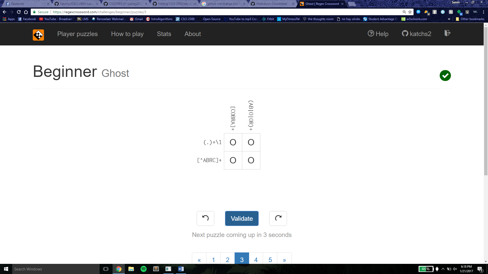
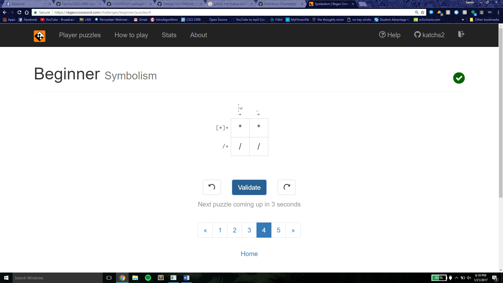
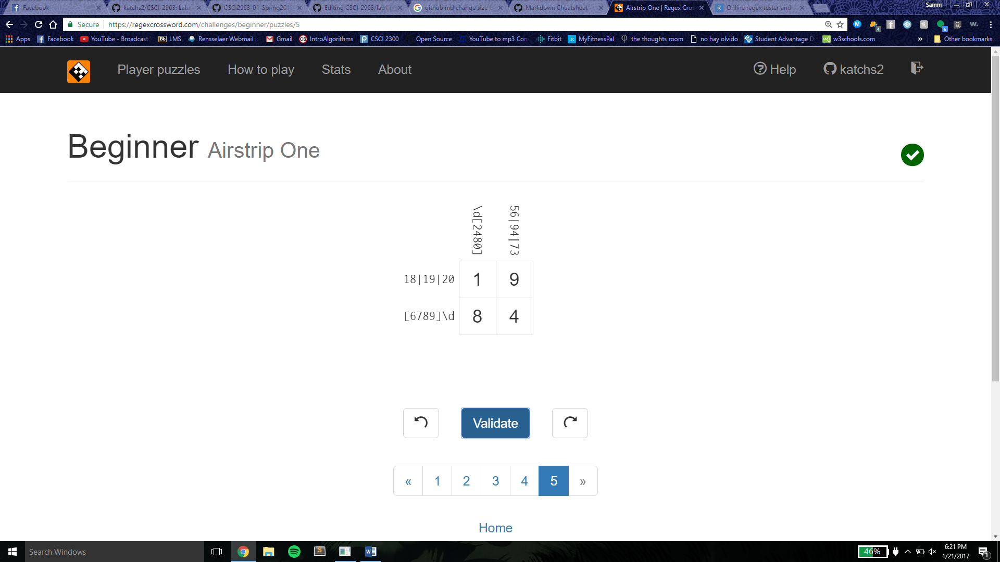

### c. Reading Assignments

# 10 Criteria of Open Source Definition 
I understand the definition of open source and understand why they are important. The empahsis on free, documented, transparent, and accessible software are all valuable qualities of open souce.

# Smart Questions: How to ask the question The Smart Way
How To Answer Questions in a Helpful Way
1. Be aware of what your knowledge base, so if you do not know the answer, use your resources and help point others in the right direction towards the answer
2. Be patient if it takes more than one time to explain the answer to a question

# Chapter 3 of Free Culture
This chapter is about RPI student Jesse Jordan who created a public database for all RPI students with all the media from public folders in RPI network computers. Because a large chunk of the files that were being shared on this database were music, Jordan was sued by the RIAA for illegally distribting music and piracy. This chapter reinforces that while it is good and important to tinker and to create open source projects, developers must be careful when they code. There are always consequences and potentially harmful uses of their products. While Jordan had not maliciously created this file sharing network, he enabled easy, free, and illegal music sharing to happen as a direct result of his code. Jordan's story also emphasizes the importance of being true to oneself. Since the lawsuit, he has become an activist to prevent others from being in situations like his own. It is important to innovate and make new things for the world, but one must be very careful what they code.

### d. Linux
# Linux Tree
.png)

### e. Regex
I completed regexone Lessons 1-7. Below is the screen shot for Lesson 7.

# Regex Crosswords

### f. Blocky

### g. Reflection
I am interested in creating open source software for students at RPI. I have been thinking about creating something that involves maps. A small scale application of mapping would be using the campus map of RPI. I think first year students would find it helpful to have an online method of finding where their new classrooms are. This app would have a database of the locations of all the classrooms, labs, and lecture halls on campus and would allow new students to figure out what building/ floor their classes are in.
