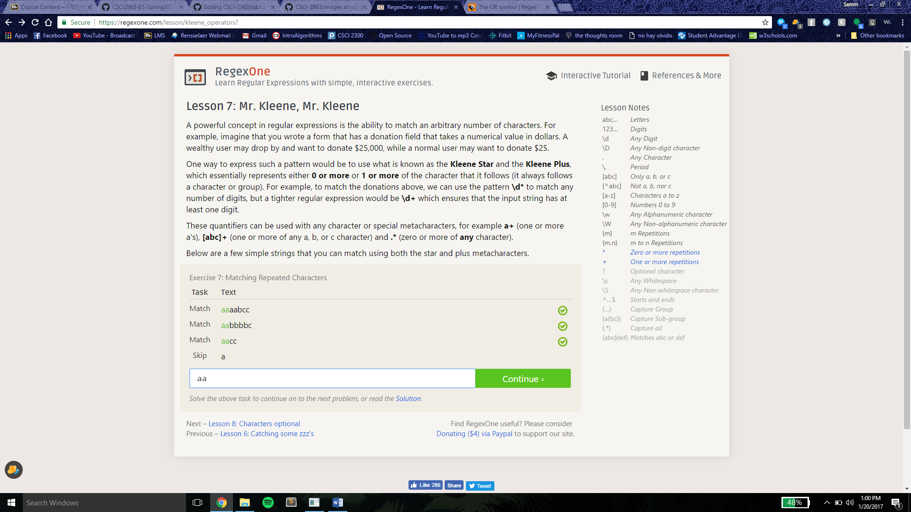

### Reading Assignments

### 10 Criteria of Open Source Definition 
http://opensource.org/osd and understand why they are important.

### Smart Questions: How to ask the question The Smart Way
Do you have more suggestions for How To Answer Questions in a Helpful Way (from your past experience) http://www.catb.org/esr/faqs/smart-questions.html#idp64834912
List at least two.

### Chapter 3 of Free Culture
Write a short paragraph ( 8 to 10 sentences) of what you got out of reading that chapter.

### Linux Tree
.png)

### Regex

