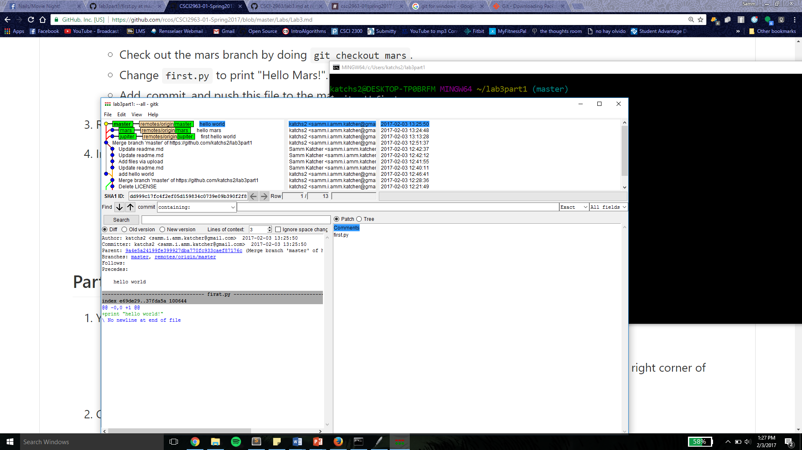
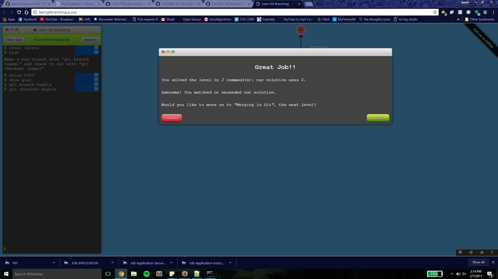
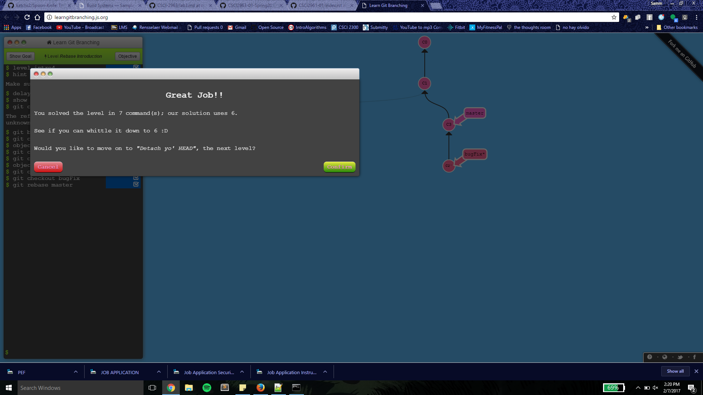

# Lab 3 Part 1 Repo
https://github.com/katchs2/lab3part1.git

gitk --all

Moorthy said it was okay that my git would not generate a graph on the command line, so I cannot compare them. But, the gitk visualization is correct.

